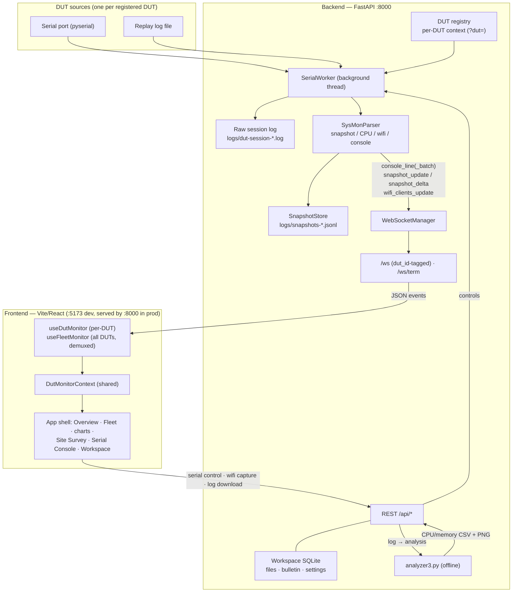

# AP6_monitor

Browser-based DUT monitoring dashboard for AP / network-device QA.
FastAPI backend + React/Vite frontend, served over your LAN and opened in any
modern browser. Monitors **multiple DUTs** (dynamic registry, per-DUT serial
sessions) with a fleet overview, per-DUT drill-down, Wi-Fi site survey, and a
shared lab workspace (files + bulletin).

> **Not a desktop app.** This build is intentionally browser-only — no Tauri,
> no Electron, no Rust, no desktop packaging. It runs as a local web service so
> a whole test lab can point a browser at one Raspberry Pi / Linux host.

## Architecture



- **Backend** (FastAPI, `:8000`) exposes a REST API and two WebSockets:
  `/ws` (telemetry events, each tagged `dut_id`) and `/ws/term` (raw
  interactive terminal bytes).
- **Multi-DUT**: a dynamic registry (`/api/duts`) gives each DUT its own serial
  worker / parser / snapshot store; per-DUT REST endpoints take `?dut=<id>`.
- **Frontend**: Vite dev server (`:5173`) proxies `/api` + `/ws` to `:8000`;
  in production the backend serves the built SPA on the **single port** `:8000`.
- **Realtime telemetry** streams over **one** `/ws` per view — the single-DUT
  monitor filters by `dut_id`, the Fleet page demuxes all DUTs from the same
  socket. **Offline analysis** (CPU/memory plots) is produced on demand by
  `analyzer3.py`.
- **Offline-first**: charts are hand-rendered inline SVG — **no Chart.js, no
  CDN, no chart library**.

## Features

- **App shell** — 12-section sidebar in three groups (Monitoring / Workspace /
  System), sticky top toolbar with a DUT switcher, KPI row, and a uniform card
  grid, built on the Luna "Spacing – Dashboards" design system (single accent
  colour + one spacing scale via CSS tokens). Responsive mobile layout with a
  nav drawer.
- **Overview** — live KPIs + connection-status pill (`Streaming` / `No DUT` /
  `Offline`), CPU trend, memory trend (post-analysis), Wi-Fi client summary,
  per-band channel recommendation, and a critical-crash feed for the selected
  DUT.
- **Fleet** — at-a-glance card per registered DUT (status / CPU busy% / crash
  count / last activity / band recommendation), all updated live from a single
  demuxed `/ws` connection.
- **Multi-DUT registry** — add/remove DUTs at runtime (`/api/duts`); every DUT
  gets its own serial session, snapshot history, and console buffer.
- **Wi-Fi tooling** — associated-client tables per VAP (`wlanconfig`), SSID
  capability report, **site survey** with per-band channel-occupancy charts and
  least-occupied-channel recommendation (auto prescan on serial connect,
  results cached across navigation), and client kick.
- **Inline-SVG charts** — CPU busy% trend (sparkline), Wi-Fi clients per radio
  (bar rows), channel-occupancy bars. Each emits its source data as
  `<script type="application/json">` so a future Chart.js migration needs zero
  backend change.
- **Serial console** with realtime line streaming, a Critical Crash panel
  (server-persisted editable keywords, see Settings), DUT log download, a
  **replay mode** for offline logs, and an **interactive terminal** mode
  (bundled xterm.js over `/ws/term`) for `vi` / `nano` on the DUT.
- **Workspace** — LAN file sharing (upload/download/delete) and a bulletin
  board with comments and per-author colour tags; identity is prefilled from
  the caller's IP (`/api/whoami`), no login. Persisted in
  `dut-dashboard/data/workspace.db` (SQLite).
- **Settings** — editable crash-keyword list (persisted server-side, shared by
  all clients) and UI preferences.
- **Release banner** — an open SPA polls `/api/version` and shows a "new
  release available → Reload" banner after a redeploy.
- **Offline analyzer** (`analyzer3.py`) → CPU/memory CSV + PNG bundle, with
  inline PNG previews in the Downloads section.

## Repository structure

```text
.
├── README.md · LICENSE · requirements.txt
├── scripts/                start_lan.sh (one-command dev/prod launcher)
├── docs/                   architecture / integration notes
└── dut-dashboard/
    ├── backend/app/        FastAPI: api/ · db/ · dut/ · parser/ · serial/ · services/ · websocket/ · main.py · config.py
    ├── frontend/src/        React/Vite: pages/ · components/{shell,charts,…} · monitoring/ · styles/ · api/
    ├── tools/              analyzer3.py · log_event_detector.py
    ├── scripts/            sysMon.sh (DUT-side telemetry script)
    ├── data/               workspace.db + uploads/ (runtime, gitignored)
    └── logs/               session logs + snapshots-*.jsonl + analyzer_output (gitignored)
```

## Quick start

### One command (recommended)

```bash
./scripts/start_lan.sh          # dev: backend :8000 + Vite :5173
./scripts/start_lan.sh --prod   # prod: build the UI, serve UI+API+WS from :8000 (single port)
```

It creates `.venv`, installs backend deps, and (on `--prod`) builds the
frontend. Open `http://<your-server-ip>:5173` (dev) or `:8000` (prod) on the LAN.

### Manual — backend (`:8000`)

```bash
python3 -m venv .venv
source .venv/bin/activate
pip install -r requirements.txt        # pulls dut-dashboard/backend/requirements.txt
cd dut-dashboard/backend
python3 -m app.main
```

### Manual — frontend (`:5173`)

```bash
cd dut-dashboard/frontend
npm install
npm run dev                            # proxies /api and /ws to :8000
```

Open `http://127.0.0.1:5173` (local) or `http://<your-server-ip>:5173` (same LAN).

### Try it with a replay log

```bash
curl -X POST http://127.0.0.1:8000/api/serial/open \
  -H 'Content-Type: application/json' \
  -d '{"mode":"replay","replay_path":"/absolute/path/to/session.log","replay_interval_ms":200}'
```

> `replay_path` is resolved relative to the **backend process working
> directory**, so pass an **absolute path**.

## Real-time data vs offline analysis

The dashboard never invents metrics. Be aware of what is live and what is not:

| Signal | Source | Live over `/ws`? |
|---|---|---|
| CPU per-core busy / idle | `snapshot_update` / `snapshot_delta` | ✅ |
| Wi-Fi client counts per radio | `wifi_clients_update` | ✅ |
| Console lines / critical-crash matches | `console_line(_batch)` | ✅ |
| Connection status | WS link + stream activity | ✅ |
| Per-client Wi-Fi detail / SSID capability / site survey | on-demand serial captures (`/api/wifi/*`) | ❌ REST, on demand |
| Channel recommendation | last site survey (server-side cache) | ❌ REST (`/api/wifi/channel-recommendation/last`) |
| **Memory** | `analyzer3.py` → `memory.csv` / `*memavailable_plot.png` | ❌ post-analysis only |

**Snapshots are persisted server-side.** The backend's `SnapshotStore`
reconstructs full snapshots from the event stream and appends them to a bounded
`logs/snapshots-<dut>.jsonl` ring, so charts backfill instantly on (re)connect
(`GET /api/snapshots`) and history survives a backend restart. The raw session
log `logs/dut-session-*.log` remains the source for offline CPU/memory
re-derivation by `analyzer3.py` at download time.

## API summary

Per-DUT endpoints accept `?dut=<id>` (defaults to the `default` DUT).

| Method | Endpoint | Purpose |
|---|---|---|
| `GET` | `/health` · `/api/version` · `/api/whoami` | liveness · build version (release banner) · caller identity prefill |
| `WS` | `/ws` | realtime events (all tagged `dut_id`): `console_line(_batch)`, `snapshot_update`, `snapshot_delta`, `wifi_clients_update` |
| `WS` | `/ws/term?dut=` | raw bytes for the interactive terminal (xterm.js) |
| `GET/POST/DELETE` | `/api/duts` | list / register / remove DUTs |
| `GET` | `/api/snapshots` · `/api/console/tail` | backfill snapshots / console lines on (re)connect |
| `POST` | `/api/serial/open` · `/close` · `/send` | open (serial/replay), close, send text/Ctrl-C |
| `GET` | `/api/serial/ports` · `/api/serial/efficiency-report` | list serial ports · parser stats |
| `POST` | `/api/serial/terminal/enter` · `/exit` · `/resize` | interactive terminal mode control |
| `GET` | `/api/serial/logs/{file}` | download log — direct `.log` or analyzer `.zip` bundle |
| `GET` | `/api/wifi/clients` · `/client-stats` · `/capabilities` · `/capability-report` | on-demand Wi-Fi captures (serial mode) |
| `GET` | `/api/wifi/site-survey` · `/channel-recommendation` · `/channel-recommendation/last` | site survey scan + per-band recommendation (last = cached, no scan) |
| `POST` | `/api/serial/wifi/kick` | kick an associated client |
| `POST` | `/api/analyzer/run` · `/run-session` | run `analyzer3.py`; `GET /api/analyzer/memory` = parsed memory series |
| `GET` | `/api/logs` · `/api/logs/tail` · `/api/download/{file}` · `/api/download/preview/{file}` | list logs · tail · download / preview analyzer artifacts |
| `GET/PUT` | `/api/settings/crash-keywords` | shared crash-keyword list (SQLite-persisted) |
| CRUD | `/api/files` · `/api/bulletin/posts` (+comments) | workspace file sharing · bulletin board |

## Known limitations

- **Memory has no realtime source** — the memory trend populates only after an
  analyzer run (post-analysis CSV); never treat it as live.
- **Wi-Fi captures need serial mode** — client tables, capability reports, and
  site surveys drive the DUT shell over serial and briefly pause sysmon
  parsing; they are unavailable in replay mode.
- **Interactive terminal assumes a single controller** per DUT and pauses
  monitoring while active.
- **No auth** — shared-trust LAN model; workspace identity is a free-text name
  prefilled from the caller's IP.

## Documentation

See **[`dut-dashboard/README.md`](dut-dashboard/README.md)** for the WebSocket
event contracts, the frontend/backend module map, the log-download + CPU/memory
plot mechanism, and the analyzer / log-event-detector tooling.
