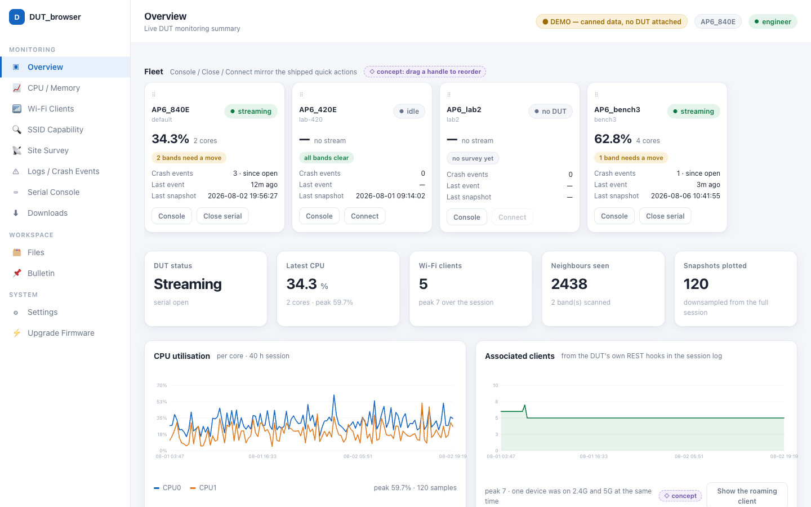
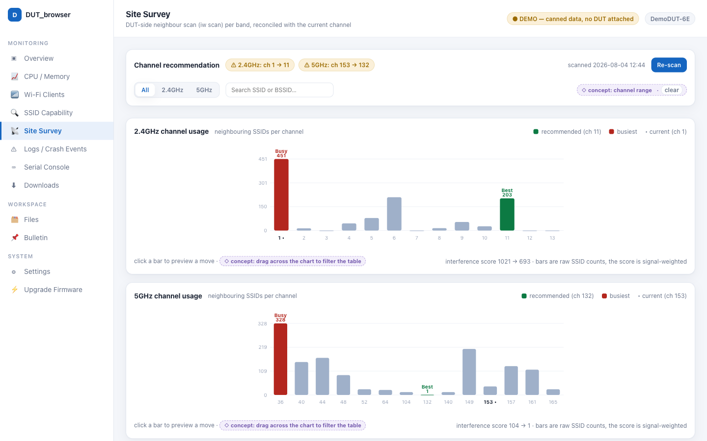
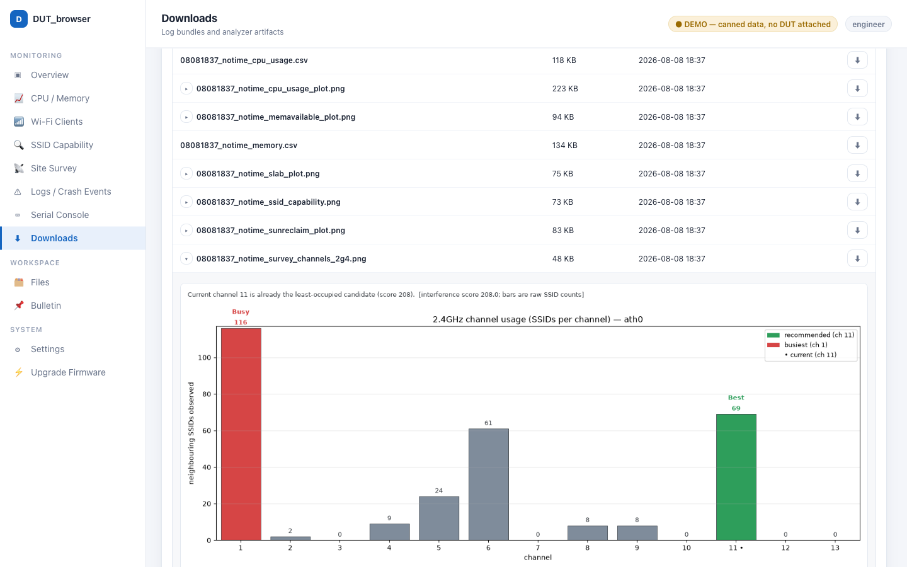
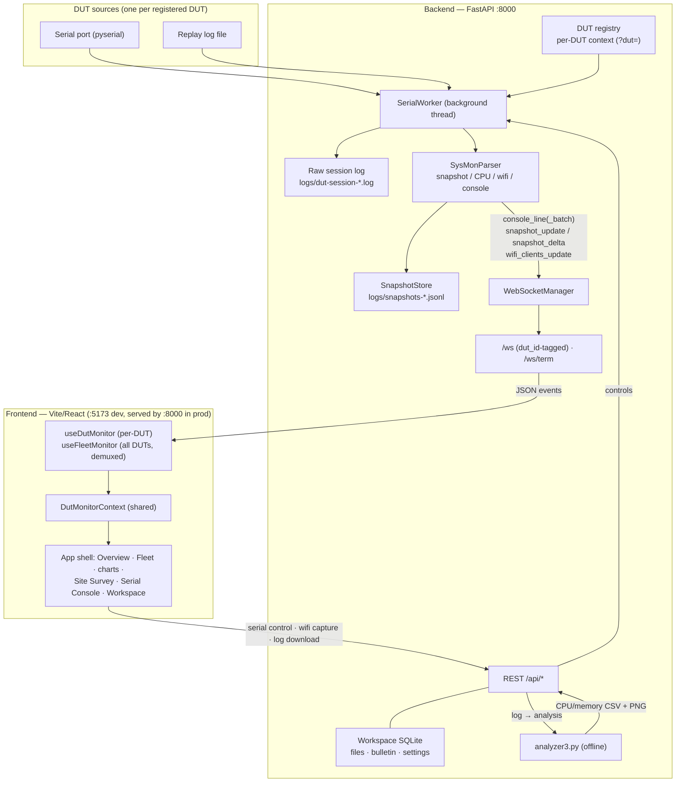

# DUT_browser

Browser-based DUT monitoring dashboard for AP / network-device QA.
FastAPI backend + React/Vite frontend, served over your LAN and opened in any
modern browser. Monitors **multiple DUTs** (dynamic registry, per-DUT serial
sessions) with a fleet overview, per-DUT drill-down, Wi-Fi site survey, and a
shared lab workspace (files + bulletin).

> **Not a desktop app.** This build is intentionally browser-only — no Tauri,
> no Electron, no Rust, no desktop packaging. It runs as a local web service so
> a whole test lab can point a browser at one Raspberry Pi / Linux host.

## See it without a DUT

### ▶ [Open the live demo](https://reviealnow.github.io/DUT_browser/)

Running the real thing needs an access point on a bench, a free serial port,
both servers and `sysMon` alive on the device. So the repository also ships a
**demo kit**: eleven self-contained HTML files in
[`dut-dashboard/demo/`](dut-dashboard/demo/) — one per screen, markup, styles,
script and data inlined.

The link above is those same files on GitHub Pages. They are equally happy off a
disk: download the folder and **double-click `index.html`** — no server, no
build, no dependencies, and it still works with the network off. That is the
point of them, and it is why they can be emailed to someone who will never clone
this repository.



*Overview: the fleet strip, the KPI row, and 40 hours of per-core CPU and
associated-client history from one session log.*

|  |  |
|:--|:--|
| **Site Survey** — per-band channel charts over a real 2,438-observation neighbour scan, with the channel recommendation and the interference score behind it. | **Downloads** — what *Download DUT Log* actually produces, listed as it came off disk, with every analyzer plot embedded in the page. |

The numbers are **measured, from real DUT sessions**; every SSID, BSSID, MAC and
IP was replaced before commit, because a neighbour scan sweeps up the networks
of everyone in radio range and none of that may be published. Anything the
product does not do is marked `◇ concept`, and each page ends with a line
naming which of its data is measured, which is synthetic, and where it came
from. [`README_demo_kit.md`](dut-dashboard/demo/README_demo_kit.md) explains
how that line is kept honest.

## Ground rules for contributors

These apply to everyone working in this repository, **including AI coding
agents** — several sessions often run in parallel against a single physical test
bench. `CONTRIBUTING.md`, `CLAUDE.md` and `dut-dashboard/CLAUDE.md` hold the full
detail; this section is the short version of what actually breaks when ignored.

### Hard constraints — do not "improve" these away

1. **Browser-only.** No Tauri, Electron, Rust, or desktop packaging.
2. **Offline-first.** No CDN at runtime, and no charting/UI library in the render
   path. Charts are hand-rendered inline SVG and must also emit their source data
   as `<script type="application/json">`. Bundled npm deps are fine; the ban is
   on CDN plus chart/UI libraries.
3. **One WebSocket.** Realtime telemetry reuses the shared monitor — do not open
   new `/ws` connections. On-demand features use REST.
4. **This app has authentication and roles** (guest / engineer / admin). Gating
   lives in one place, `main.py`'s `include_router(..., dependencies=[...])`.
   Authorship of uploads and posts comes from the **session**, never from a
   client-supplied name. Do not weaken either; older docs describing a
   "no login, shared-trust" model are out of date.
5. **Never commit runtime data.** Everything under `dut-dashboard/logs/` and
   `dut-dashboard/data/` is gitignored, and `snapshots.jsonl` may hold real
   captured DUT data — do not delete it while testing.
6. **No background polling of the serial port.** `capture_command` is a
   synchronous RPC that pauses sysmon parsing; trigger it on section entry or an
   explicit user action only, and coalesce concurrent captures.

### Gates

`pytest` (from `dut-dashboard/backend`) and `npm run typecheck` (from
`dut-dashboard/frontend`) must **both** pass at every commit. There is no
wired-up linter; these two are the gates. When behaviour changes, change the
tests with it, and prefer a test that goes red if the fix is reverted.

### Git

Branch from **`CPU_Plots`** and open pull requests against it. **Never target
`main` or `Tauri`.** Conventional Commits, one logical change per commit.
Everything committed is **English** — code, comments, identifiers, commit
messages, branch names, PR descriptions.

### Shared hardware — check before you touch it

The bench is one physical device, and parallel sessions collide on it:

| Resource | Rule |
|---|---|
| Serial port (`/dev/cu.PL2303G-*` or similar) | **Exactly one process may hold it.** Run `lsof <port>` before opening. Hand it back when a human needs the console — the DUT requires a login on it after every reboot. |
| The DUT itself | One device. Firmware upgrades, site surveys and serial captures interfere with each other. After any web-UI submit the DUT refuses further ones for several minutes. |
| Ports `:8000` / `:5173` | Whoever starts first owns them. `.claude/launch.json` carries a `backend-8001` profile for a second session. |

**Never power-cycle a DUT that may be writing flash.** A firmware upgrade is
confirmed by the device's own console output and audit log — not by an HTTP
status, and not by the UI's "Connected" label, which survives a backend restart
that has already dropped the serial worker.

### Parallel work: use a worktree

```bash
git worktree add -b feat/my-thing ../DUT_browser-my-thing CPU_Plots
```

A fresh worktree does **not** inherit the gitignored parts — `.venv`,
`dut-dashboard/data/`, and `frontend/node_modules` must be created in it. An
empty `data/` is a feature for QA: the app builds a clean `workspace.db` instead
of sharing the primary checkout's.

## Architecture



- **Backend** (FastAPI, `:8000`) exposes a REST API and two WebSockets:
  `/ws` (telemetry events, each tagged `dut_id`) and `/ws/term` (raw
  interactive terminal bytes).
- **Multi-DUT**: a dynamic registry (`/api/duts`) gives each DUT its own serial
  worker / parser / snapshot store; per-DUT REST endpoints take `?dut=<id>`.
- **Frontend**: Vite dev server (`:5173`) proxies `/api` + `/ws` to `:8000`;
  in production the backend serves the built SPA on the **single port** `:8000`.
- **Realtime telemetry** streams over **one** `/ws` per view — the single-DUT
  monitor filters by `dut_id`, the Fleet page demuxes all DUTs from the same
  socket. **Offline analysis** (CPU/memory plots) is produced on demand by
  `analyzer3.py`.
- **Offline-first**: charts are hand-rendered inline SVG — **no Chart.js, no
  CDN, no chart library**.

## Features

- **App shell** — 12-section sidebar in three groups (Monitoring / Workspace /
  System), sticky top toolbar with a DUT switcher, KPI row, and a uniform card
  grid, built on the Luna "Spacing – Dashboards" design system (single accent
  colour + one spacing scale via CSS tokens). Responsive mobile layout with a
  nav drawer.
- **Overview** — live KPIs + connection-status pill (`Streaming` / `No DUT` /
  `Offline`), CPU trend, memory trend (live from streamed `/proc/meminfo`, with
  a post-analysis fallback), Wi-Fi client summary, per-band channel
  recommendation, and a critical-crash feed for the selected DUT.
- **Fleet** — at-a-glance card per registered DUT (status / CPU busy% / crash
  count / last activity / band recommendation), all updated live from a single
  demuxed `/ws` connection.
- **Multi-DUT registry** — add/remove DUTs at runtime (`/api/duts`); every DUT
  gets its own serial session, snapshot history, and console buffer.
- **Wi-Fi tooling** — associated-client tables per VAP (`wlanconfig`), SSID
  capability report, **site survey** with per-band channel-occupancy charts and
  least-occupied-channel recommendation (auto prescan on serial connect,
  results cached across navigation), and client kick.
- **Inline-SVG charts** — CPU busy% trend (sparkline), Wi-Fi clients per radio
  (bar rows), channel-occupancy bars. Each emits its source data as
  `<script type="application/json">` so a future Chart.js migration needs zero
  backend change.
- **Serial console** with realtime line streaming, a Critical Crash panel
  (server-persisted editable keywords, see Settings), DUT log download, a
  **replay mode** for offline logs, and an **interactive terminal** mode
  (bundled xterm.js over `/ws/term`) for `vi` / `nano` on the DUT.
- **Workspace** — LAN file sharing (upload/download/delete, SHA-256 per file)
  and a bulletin board with comments and per-author colour tags. Authorship
  comes from the session when there is one. Persisted in
  `dut-dashboard/data/workspace.db` (SQLite).
- **Roles and access** — guest browsing by default; `engineer` and `admin`
  unlock the operating surfaces via a shared passcode or a QR invite token.
  Role changes are recorded in an append-only audit trail.
- **Firmware upgrade (admin only)** — flash a DUT from the browser over the
  device's web-UI upload path, with the image taken from the workspace, its
  checksum verified before a byte is sent, a rehearsal (dry-run) button, a
  confirm dialog that requires typing the DUT's name back, and confirmation
  that the flash actually began read from the DUT's serial console.
- **Settings** — editable crash-keyword list (persisted server-side, shared by
  all clients) and UI preferences.
- **Release banner** — an open SPA polls `/api/version` and shows a "new
  release available → Reload" banner after a redeploy.
- **Offline analyzer** (`analyzer3.py`) → CPU/memory CSV + PNG bundle, with
  inline PNG previews in the Downloads section.

## Repository structure

```text
.
├── README.md · LICENSE · requirements.txt
├── scripts/                start_lan.sh (one-command dev/prod launcher)
├── docs/                   architecture / integration notes · screenshots/
└── dut-dashboard/
    ├── backend/app/        FastAPI: api/ · db/ · dut/ · parser/ · serial/ · services/ · websocket/ · main.py · config.py
    ├── frontend/src/        React/Vite: pages/ · components/{shell,charts,…} · monitoring/ · styles/ · api/
    ├── demo/               the demo kit — one self-contained HTML file per screen,
    │                       build_demo_data.py to regenerate them from a real
    │                       bundle, verify/ to drive them in a real DOM
    ├── tools/              analyzer3.py · log_event_detector.py
    ├── scripts/            sysMon.sh (DUT-side telemetry script)
    ├── data/               workspace.db + uploads/ (runtime, gitignored)
    └── logs/               session logs + snapshots-*.jsonl + analyzer_output (gitignored)
```

## Quick start

### One command (recommended)

```bash
./scripts/start_lan.sh          # dev: backend :8000 + Vite :5173
./scripts/start_lan.sh --prod   # prod: build the UI, serve UI+API+WS from :8000 (single port)
```

It creates `.venv`, installs backend deps, and (on `--prod`) builds the
frontend. Open `http://<your-server-ip>:5173` (dev) or `:8000` (prod) on the LAN.

### Manual — backend (`:8000`)

```bash
python3 -m venv .venv
source .venv/bin/activate
pip install -r requirements.txt        # pulls dut-dashboard/backend/requirements.txt
cd dut-dashboard/backend
python3 -m app.main
```

### Manual — frontend (`:5173`)

```bash
cd dut-dashboard/frontend
npm install
npm run dev                            # proxies /api and /ws to :8000
```

Open `http://127.0.0.1:5173` (local) or `http://<your-server-ip>:5173` (same LAN).

### Try it with a replay log

```bash
curl -X POST http://127.0.0.1:8000/api/serial/open \
  -H 'Content-Type: application/json' \
  -d '{"mode":"replay","replay_path":"/absolute/path/to/session.log","replay_interval_ms":200}'
```

> `replay_path` is resolved relative to the **backend process working
> directory**, so pass an **absolute path**.

## Real-time data vs offline analysis

The dashboard never invents metrics. Be aware of what is live and what is not:

| Signal | Source | Live over `/ws`? |
|---|---|---|
| CPU per-core busy / idle | `snapshot_update` / `snapshot_delta` | ✅ |
| Wi-Fi client counts per radio | `wifi_clients_update` | ✅ |
| Console lines / critical-crash matches | `console_line(_batch)` | ✅ |
| Connection status | WS link + stream activity | ✅ |
| Per-client Wi-Fi detail / SSID capability / site survey | on-demand serial captures (`/api/wifi/*`) | ❌ REST, on demand |
| Channel recommendation | last site survey (server-side cache) | ❌ REST (`/api/wifi/channel-recommendation/last`) |
| Memory (MemAvailable/Slab/…) | `/proc/meminfo` streamed inside snapshot blocks | ✅ (needs the DUT-side `sysMon.sh` dump) |
| Memory from an arbitrary offline log | `analyzer3.py` → `memory.csv` / `*memavailable_plot.png` | ❌ post-analysis |

**Snapshots are persisted server-side.** The backend's `SnapshotStore`
reconstructs full snapshots from the event stream and appends them to a bounded
`logs/snapshots-<dut>.jsonl` ring, so charts backfill instantly on (re)connect
(`GET /api/snapshots`) and history survives a backend restart. The raw session
log `logs/dut-session-*.log` remains the source for offline CPU/memory
re-derivation by `analyzer3.py` at download time.

## API summary

Per-DUT endpoints accept `?dut=<id>` (defaults to the `default` DUT).

| Method | Endpoint | Purpose |
|---|---|---|
| `GET` | `/health` · `/api/version` · `/api/whoami` | liveness · build version (release banner) · caller identity prefill |
| `WS` | `/ws` | realtime events (all tagged `dut_id`): `console_line(_batch)`, `snapshot_update`, `snapshot_delta`, `wifi_clients_update` |
| `WS` | `/ws/term?dut=` | raw bytes for the interactive terminal (xterm.js) |
| `GET/POST/DELETE` | `/api/duts` | list / register / remove DUTs |
| `GET` | `/api/snapshots` · `/api/console/tail` | backfill snapshots / console lines on (re)connect |
| `POST` | `/api/serial/open` · `/close` · `/send` | open (serial/replay), close, send text/Ctrl-C |
| `GET` | `/api/serial/ports` · `/api/serial/efficiency-report` | list serial ports · parser stats |
| `POST` | `/api/serial/terminal/enter` · `/exit` · `/resize` | interactive terminal mode control |
| `GET` | `/api/serial/logs/{file}` | download log — direct `.log` or analyzer `.zip` bundle |
| `GET` | `/api/wifi/clients` · `/client-stats` · `/capabilities` · `/capability-report` | on-demand Wi-Fi captures (serial mode) |
| `GET` | `/api/wifi/site-survey` · `/channel-recommendation` · `/channel-recommendation/last` | site survey scan + per-band recommendation (last = cached, no scan) |
| `POST` | `/api/serial/wifi/kick` | kick an associated client |
| `POST` | `/api/analyzer/run` · `/run-session` | run `analyzer3.py`; `GET /api/analyzer/memory` = parsed memory series |
| `GET` | `/api/logs` · `/api/logs/tail` · `/api/download/{file}` · `/api/download/preview/{file}` | list logs · tail · download / preview analyzer artifacts |
| `GET/PUT` | `/api/settings/crash-keywords` | shared crash-keyword list (SQLite-persisted) |
| CRUD | `/api/files` · `/api/bulletin/posts` (+comments) | workspace file sharing · bulletin board |
| `POST/GET` | `/api/auth/register` · `/me` · `/logout` · `/redeem` · `/invites` · `/users` · `/role-changes` | role sessions · QR invite tokens · roster + audit trail (admin) |
| `GET/POST` | `/api/firmware/config` · `/upgrade` | admin firmware upgrade: transports, DUT access, dry run + real flash |

## Known limitations

- **Live memory needs the DUT-side script** — the memory trend streams live
  only when the DUT runs `sysMon.sh` (it dumps `/proc/meminfo` into each
  snapshot block); for arbitrary logs it falls back to the post-analysis CSV
  from `analyzer3.py`.
- **Wi-Fi captures need serial mode** — client tables, capability reports, and
  site surveys drive the DUT shell over serial and briefly pause sysmon
  parsing; they are unavailable in replay mode.
- **Interactive terminal assumes a single controller** per DUT and pauses
  monitoring while active.
- **Auth is role-based, not per-user access control** — browsing is open as
  `guest`; `engineer` and `admin` are unlocked by a shared passcode (or a QR
  invite token), so a role proves someone held the passcode, not who they are.
  Authorship of uploads and posts is session-derived and marked *unverified* on
  rows that predate that. Sessions are cookie-backed; `--prod` serves HTTPS.

## Documentation

See **[`dut-dashboard/README.md`](dut-dashboard/README.md)** for the WebSocket
event contracts, the frontend/backend module map, the log-download + CPU/memory
plot mechanism, and the analyzer / log-event-detector tooling.

See **[`dut-dashboard/demo/README_demo_kit.md`](dut-dashboard/demo/README_demo_kit.md)**
for the demo kit: how to regenerate its data from a capture, the anonymisation
the generator refuses to skip, and the parity bar those pages are held to —
match the product's *observable contract*, on the test that a demo accepting
what the product refuses has crossed the line.
