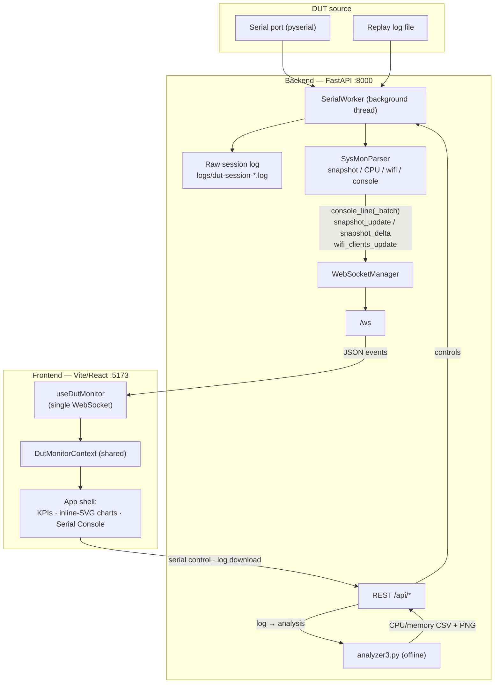

# AP6_monitor

Browser-based DUT monitoring dashboard for AP / network-device QA.
FastAPI backend + React/Vite frontend, served over your LAN and opened in any
modern browser.

> **Not a desktop app.** This build is intentionally browser-only — no Tauri,
> no Electron, no Rust, no desktop packaging. It runs as a local web service so
> a whole test lab can point a browser at one Raspberry Pi / Linux host.

## Architecture



- **Backend** (FastAPI, `:8000`) exposes a REST API and a `/ws` WebSocket.
- **Frontend** (Vite/React, `:5173`) proxies `/api` and `/ws` to `:8000`.
- **Realtime telemetry** streams over **one** WebSocket; **offline analysis**
  (CPU/memory plots) is produced on demand by `analyzer3.py`.
- **Offline-first**: charts are hand-rendered inline SVG — **no Chart.js, no
  CDN, no chart library**.

## Features

- **App shell** — 7-section left sidebar, sticky top toolbar, KPI row, and a
  uniform card grid, built on the Luna "Spacing – Dashboards" design system
  (single accent colour + one spacing scale via CSS tokens).
- **Single shared WebSocket monitor** (`useDutMonitor` + React context) feeding
  4 live KPIs and a connection-status pill (`Streaming` / `No DUT` / `Offline`).
- **Inline-SVG charts** — CPU busy% trend (sparkline), Wi-Fi clients per radio
  (bar rows), and a critical-crash feed. Each emits its source data as
  `<script type="application/json">` so a future Chart.js migration needs zero
  backend change.
- **Serial console** with realtime line streaming, a Critical Crash panel (live
  built-in keywords + user lock-in), DUT log download, and a **replay mode**
  for offline logs.
- **Offline analyzer** (`analyzer3.py`) → CPU/memory CSV + PNG bundle.

## Repository structure

```text
.
├── README.md · LICENSE · requirements.txt
└── dut-dashboard/
    ├── backend/app/        FastAPI: api/ · parser/ · serial/ · services/ · websocket/ · main.py · config.py
    ├── frontend/src/        React/Vite: pages/ · components/{shell,charts} · monitoring/ · styles/ · api/
    ├── tools/              analyzer3.py · log_event_detector.py
    ├── scripts/            sysMon.sh (DUT-side telemetry script)
    └── logs/               session logs + analyzer_output (gitignored)
```

## Quick start

### Backend (`:8000`)

```bash
python3 -m venv .venv
source .venv/bin/activate
pip install -r requirements.txt        # pulls dut-dashboard/backend/requirements.txt
cd dut-dashboard/backend
python3 -m app.main
```

### Frontend (`:5173`)

```bash
cd dut-dashboard/frontend
npm install
npm run dev                            # proxies /api and /ws to :8000
```

Open `http://127.0.0.1:5173` (local) or `http://<your-server-ip>:5173` (same LAN).

### Try it with a replay log

```bash
curl -X POST http://127.0.0.1:8000/api/serial/open \
  -H 'Content-Type: application/json' \
  -d '{"mode":"replay","replay_path":"/absolute/path/to/session.log","replay_interval_ms":200}'
```

> `replay_path` is resolved relative to the **backend process working
> directory**, so pass an **absolute path**.

## Real-time data vs offline analysis

The dashboard never invents metrics. Be aware of what is live and what is not:

| Signal | Source | Live over `/ws`? |
|---|---|---|
| CPU per-core busy / idle | `snapshot_update` | ✅ |
| Wi-Fi client counts per radio | `wifi_clients_update` | ✅ |
| Console lines / critical-crash matches | `console_line(_batch)` | ✅ |
| Connection status | WS link + stream activity | ✅ |
| **Memory** | `analyzer3.py` → `memory.csv` / `*memavailable_plot.png` | ❌ offline only |

**Snapshots are ephemeral.** They are emitted over `/ws` and kept in the
browser only (`useDutMonitor.cpuHistory`, ≤120 points, cleared on reload). The
**durable** artifact is the raw session log `logs/dut-session-*.log`; structured
CPU/memory is re-derived from it by `analyzer3.py` at download time.
(`logs/snapshots.jsonl` is a reserved placeholder and is currently empty.)

## API summary

| Method | Endpoint | Purpose |
|---|---|---|
| `GET` | `/health` | liveness |
| `WS` | `/ws` | realtime events: `console_line`, `console_line_batch`, `snapshot_update`, `snapshot_delta`, `wifi_clients_update` |
| `GET` | `/api/serial/ports` | list serial ports |
| `POST` | `/api/serial/open` · `/close` · `/send` | open (serial/replay), close, send text/Ctrl-C |
| `GET` | `/api/serial/logs/{file}` | download log — direct `.log` or analyzer `.zip` bundle |
| `GET` | `/api/serial/efficiency-report` | parser stats |
| `POST` | `/api/analyzer/run` | run `analyzer3.py` on a log path |
| `GET` | `/api/download/{file}` | download analyzer artifact |

## Roadmap / known limitations

- **Snapshot history is in-memory only** (front-end). Planned: server-side
  snapshot persistence (`SnapshotStore` is currently a no-op placeholder) plus
  on-connect **backfill**, so charts populate instantly after a reload instead
  of waiting for the next snapshot; lower console batch latency and a connection
  heartbeat for snappier feedback.

## Documentation

See **[`dut-dashboard/README.md`](dut-dashboard/README.md)** for the WebSocket
event contracts, the frontend/backend module map, the log-download + CPU/memory
plot mechanism, and the analyzer / log-event-detector tooling.
